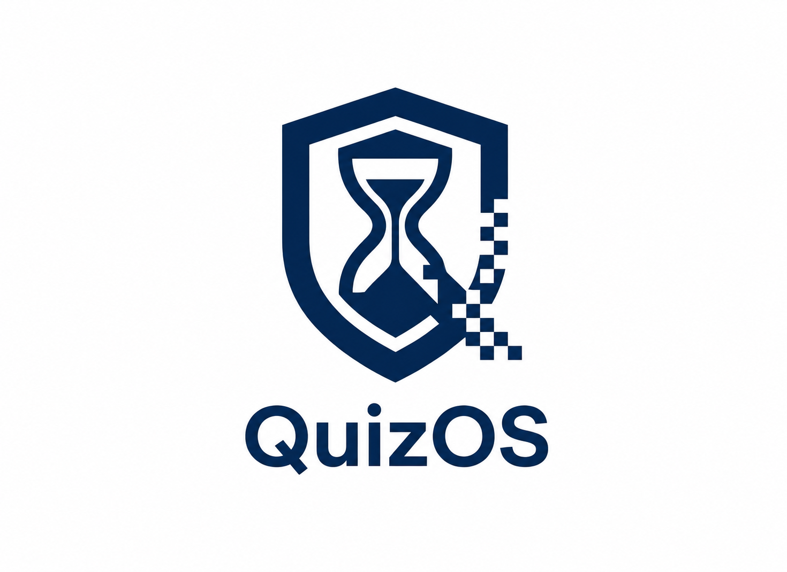

<div align="center">



# QuizOS

**Secure online examination and live lecture platform for Federal University of Technology Owerri**

[](https://www.typescriptlang.org/)
[](https://react.dev/)
[](https://expressjs.com/)
[](https://www.prisma.io/)
[](https://vercel.com/)

[**Live App →**](https://quiz-portal.vercel.app)

</div>

---


## What Is This?

QuizOS is a full-stack academic portal built to replace paper-based and informal CBT processes at Nigerian universities. It handles the full assessment lifecycle - from a lecturer uploading notes and creating a quiz, to a student taking a time-boxed exam with anti-cheat enforcement, through to AI-assisted grading and analytics.

It also runs live audio lectures (WebRTC + Ably) with hand-raise queues, polls, and attendance tracking - all from a single deployment on Vercel's free tier, with no paid backend server.

---

## Features

### For Students

| Tab | What it does |
|-----|-------------|
| **Notes** | Read lecturer-uploaded course notes with full Markdown + LaTeX math rendering |
| **Quizzes** | Take time-boxed MCQ assessments in a secure exam engine (see Security below) |
| **Exams** | Submit written essay exams; supports typed answers or file uploads |
| **Assignments** | Submit assignments with text or attached files; AI-assisted grading |
| **Live Classroom** | Join real-time audio sessions; raise hand to request the mic |
| **History** | View all past attempts, scores, and per-question answer breakdowns |
| **Calendar** | See upcoming quizzes, exams, and assignment deadlines |
| **Discussions** | Course-scoped discussion board with thread replies |

### For Lecturers

| Tab | What it does |
|-----|-------------|
| **Gradebook** | All student submissions in one place - filter by course, export CSV |
| **Courses** | Create and manage courses per department and year level |
| **Notes** | Upload lecture notes via .docx file upload or direct text editor |
| **Quizzes** | Create MCQ quizzes; AI generates questions from pasted text or an uploaded file |
| **Exams** | Upload written exam PDFs; AI grades student submissions against an answer key |
| **Assignments** | Create and manage assignments; AI assists with grading |
| **Live Lecture** | Start a live audio session with slide sharing (.pptx), polls, hand-raise queue, chat, and attendance tracking |
| **Analytics** | Score distribution charts, per-question success rates, class-wide pass/fail breakdown |
| **Announcements** | Send push notifications to all students (Web Push / PWA) |
| **Departments** | Manage departments and student enrollment |
| **Calendar** | Schedule and view all assessments |
| **Discussions** | Moderate course discussions; pin important threads |

### Exam Security

The exam engine mirrors an invigilated CBT centre:

- **Tab-switch detection** - 3-strike system; third violation auto-submits and locks the session
- **Fullscreen enforcement** - entering fullscreen on exam start; leaving counts as a violation
- **Question randomisation** - questions are shuffled per session
- **Server-side timer** - client and server clocks sync every 10 seconds; the server is the source of truth
- **Auto-submit on timeout** - session is locked and scored server-side when time expires, regardless of network state
- **Answers auto-saved** - written to `localStorage` on every answer change and every 10 seconds; survives network drops, tab suspend, and accidental refresh
- **Copy-protection overlay** - student watermark rendered across the exam surface
- **Offline recovery banner** - notifies the student when network drops and confirms answers are safe

---

## Tech Stack

| Layer | Technology |
|-------|-----------|
| Frontend | React 19, TypeScript, Tailwind CSS v4, Framer Motion |
| Backend | Express.js 4, Node.js, TypeScript |
| Database | Prisma ORM → Turso (libSQL / SQLite edge) |
| Auth | JWT (jsonwebtoken) + bcrypt |
| Real-time audio | WebRTC (full-mesh) + Ably Realtime (signaling + presence) |
| TURN / NAT traversal | Open Relay (free public TURN, no account needed) |
| AI features | NVIDIA NIM API (Llama 4) - question generation, essay grading, lecture summarisation |
| File parsing | Mammoth (.docx → HTML), JSZip (.pptx slide extraction) |
| Math rendering | KaTeX via remark-math + rehype-katex |
| Push notifications | Web Push (VAPID) |
| PWA | Service Worker (cache-first for assets, network-first for API) |
| Deployment | Vercel (serverless functions + static frontend) |

---

## Local Setup

### Prerequisites

- Node.js 18+
- A [Turso](https://turso.tech) database (free tier works)
- An [Ably](https://ably.com) account (free tier, no credit card)

### Steps

```bash
# 1. Clone and install
git clone https://github.com/mimisco-git/Quiz-Portal.git
cd Quiz-Portal
npm install

# 2. Copy the env template
cp .env.example .env

# 3. Fill in your values (see table below)
# Then run the dev server:
npm run dev
```

The app runs at `http://localhost:3000`. The backend and frontend are served from the same Express process in development.

---

## Environment Variables

Create a `.env` file in the project root:

```env
# Database - Turso
DATABASE_URL=libsql://your-db-name.turso.io
TURSO_AUTH_TOKEN=your-turso-auth-token

# Auth - generate with: openssl rand -hex 32
JWT_SECRET=your-64-character-hex-secret

# Real-time audio (Ably) - copy the Root key from your Ably app dashboard
ABLY_API_KEY=your-ably-api-key

# AI features (NVIDIA NIM) - optional; disables AI grading/generation if absent
NVIDIA_API_KEY=your-nvidia-nim-key

# Push notifications (Web Push) - optional; disables announcements if absent
VAPID_PUBLIC_KEY=your-vapid-public-key
VAPID_PRIVATE_KEY=your-vapid-private-key
VAPID_EMAIL=admin@yourdomain.com
```

| Variable | Required | How to get it |
|----------|----------|---------------|
| `DATABASE_URL` | Yes | [turso.tech](https://turso.tech) → create a database → copy the URL |
| `TURSO_AUTH_TOKEN` | Yes | Turso dashboard → database → generate token |
| `JWT_SECRET` | Yes | `openssl rand -hex 32` in your terminal |
| `ABLY_API_KEY` | Yes (audio) | [ably.com](https://ably.com) → Apps → API Keys → copy Root key |
| `NVIDIA_API_KEY` | No | [build.nvidia.com](https://build.nvidia.com) → API Keys |
| `VAPID_*` | No | `npx web-push generate-vapid-keys` |

For **Vercel deployment**, add all variables under **Settings → Environment Variables** and redeploy.

---

## Project Structure

```
Quiz-Portal/
├── src/
│   ├── components/
│   │   ├── LandingScreen.tsx      # macOS-style login / boot screen
│   │   ├── StudentDashboard.tsx   # Full student portal (8 tabs + secure exam engine)
│   │   ├── LecturerDashboard.tsx  # Full lecturer portal (12 tabs)
│   │   ├── LiveAudioRoom.tsx      # WebRTC + Ably audio room
│   │   ├── SlideView.tsx          # Fullscreen slide presentation
│   │   ├── SecureContent.tsx      # Watermark overlay for exam content
│   │   └── ...
│   ├── lib/
│   │   ├── db.ts                  # Prisma client (Turso adapter)
│   │   └── seed.ts                # Initial department seeding
│   ├── types.ts
│   └── App.tsx                    # Root - auth state, session expiry, theme
├── server.ts                      # Express API (3600+ lines, all routes)
├── api/index.ts                   # Vercel serverless entry point
├── prisma/schema.prisma           # Database schema (20 models)
├── public/
│   ├── sw.js                      # Service Worker (offline caching)
│   └── manifest.json              # PWA manifest
├── vercel.json
└── vite.config.ts
```

---

## Scripts

| Command | What it does |
|---------|-------------|
| `npm run dev` | Start the development server (Express serves both API and Vite HMR) |
| `npm run build` | Build frontend (Vite) + backend (esbuild) for production |
| `npm run lint` | TypeScript type check |
| `npm start` | Run the production build locally |

---

## Deployment

This project is configured for **Vercel** out of the box:

1. Push to GitHub
2. Import the repo in Vercel
3. Add all environment variables under Settings → Environment Variables
4. Deploy - Vercel runs `npm run vercel-build` (`prisma generate && vite build`) automatically

The backend runs as a single serverless function at `/api/index.ts`. The frontend is served as a static SPA. Ably handles all real-time signaling so no persistent WebSocket server is needed.

---

## Demo Deployment (Isolated)

The public demo runs as a **completely separate Vercel project** pointing at its own Turso database. It shares the same codebase but uses different environment variables so demo activity never touches the real FUTO data.

### Setup steps

1. Create a second Turso database (e.g. `quizos-demo`)
2. Apply the schema:
   ```bash
   TURSO_DATABASE_URL="libsql://your-demo-db.turso.io" \
   TURSO_AUTH_TOKEN="your-demo-token" \
   npx prisma db push
   ```
3. Seed it with fake students, lecturers, quizzes, and notes:
   ```bash
   TURSO_DATABASE_URL="libsql://your-demo-db.turso.io" \
   TURSO_AUTH_TOKEN="your-demo-token" \
   JWT_SECRET="any-secret" \
   npx tsx src/lib/seed-demo.ts
   ```
4. Import the same GitHub repo into a new Vercel project and set the demo database env vars
5. Deploy

The seed script creates 2 lecturers and 10 fake students with known credentials, 4 courses, 4 quizzes, sample quiz history, lecture notes, assignments, and discussion threads.

---

## License

MIT © 2026 FUTO Academic Portal
